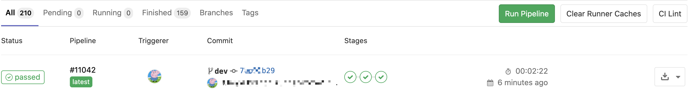
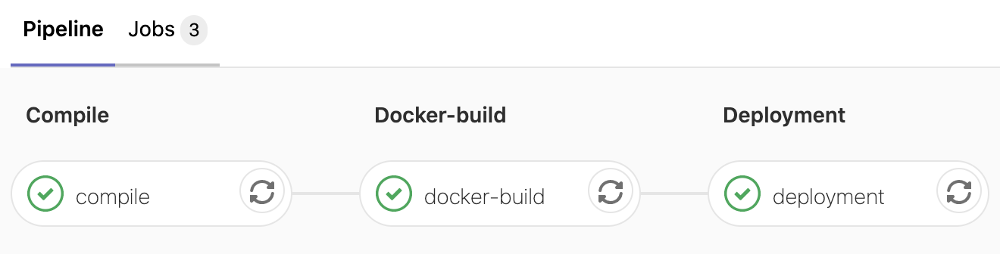
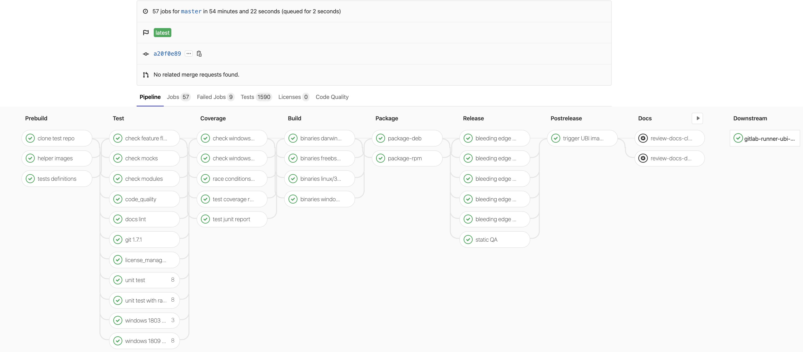
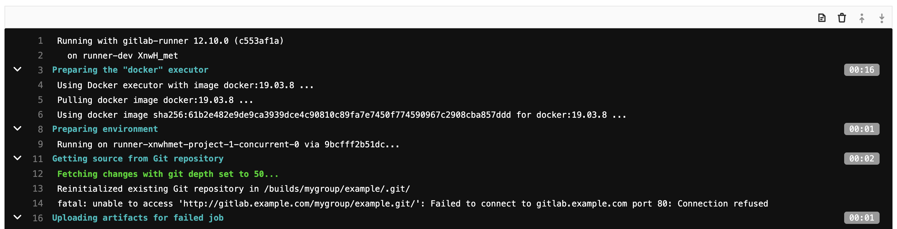

# 晨光科力普基于gitlab-ci/cd持续集成服务的应用

## 简要介绍gitlab-ci/cd在晨光科力普项目中的应用

### 背景介绍

科力普省心购是晨光文具集团在19年初为了拓展综合办公物资采购业务成立的电商平台，面向中小企业和个人客户。省心购项目启动之前，公司其他项目多为企业、政府、事业单位等提供办公用品采购服务，采用定期发版的方式保证系统的稳健运行，一个小的需求也可能要等上一周才会发布。多达五套的运行环境使得我们需要一款能够保证省心购项目快速迭代的CI/CD工具。

### 为什么选择gitlab-ci/cd

首先是公司选择了gitlab作为代码仓库，本身包含协调作业的开源持续集成服务`gitlab-ci/cd`，那么`gitlab-ci/cd`自然成了我们首先调研的对象。`gitlab`作为服务的提供者，由`gitlab-runner`注册后依轮询的方式获取服务的指令，执行相应的构建动作，同时将构建进度和结果及时返回给gitlab并在web端仓库侧边栏`CI/CD`->`Pipelines`页面中滚动展示出来。`Setting`->`CI/CD`模块下的`Auto DevOps` 自动化DevOps功能、`Variables`变量配置，`Runners`执行者等配置项提供了强大的公共配置管理功能。在编写完`.gitlab-ci.yml`构建配置文件和`dockerfile`文件即可满足我们的自动化需求。从我们使用的大半年时间来看，官方对于`gitlab-ci/cd`的迭代速度也是非常快的，基本上每个月都会有新特性的加入。

### 分支与环境介绍

|  git分支  | K8S集群 | 运行环境 |             说明             |
|:---------:|:-------:|:--------:|:----------------------------:|
|    dev    |   dev   |   dev    |           开发环境           |
|   test    |  test   |   test   |           测试环境           |
|    uat    |   uat   |   uat    |           验收环境           |
|    prd    |   prd   | pre、prd |     金丝雀和生产环境     |
| feature-* |         |          | 需求分支，按需合并到环境分支 |

流程简述：

我们采用`合并即发布`的策略，`push`对应环境分支自动部署。其中`prd`分支的金丝雀环境自动部署，生产环境需手动触发。开发同学基于`teambition`认领新的需求，创建`feature-*`分支，按需合并到dev，test，uat分支发布。现在我们的流程仅有三个阶段：`compile`编译、`docker-build`镜像构建和`deployment`部署。从提交代码到部署成功约3分钟时间，除生产分支外零人为干预。也有许多待完善的地方，比如尚未集成`commit-check`提交检查、`test`自动测试、`deployment-check`部署状态检查、`deployment-rollback`部署回滚等阶段配置，这些也是我们下一步计划要做的事情。


### gitlab-ci/cd的相关介绍

- `gitlab-runner` 持续集成服务的执行者，官方提供了多种部署方式，如常见的shell，docker，docker-machine，kubernetes等。基于部署维护和权限方面的考量，我们最终选择了docker作为执行者，为每个团队启动一个runner容器，容器内按分支注册了4个`worker`分别处理各个分支的构建任务。

- `.gitlab-ci.yml` 持续集成配置文件，配置构建任务的顺序和结构。若使用docker部署，每个阶段需要指定该阶段所需的镜像。

```yaml
#.gitlab-ci.yml示例
stages:
  - compile # 编译阶段
  - docker-build # 镜像构建阶段
  - deployment # 部署阶段

compile:
  stage: compile
  image: golang:1.14.2
  script:
      - go build # 执行编译命令 go build 或 npm ci 等
  artifacts:
    paths:
      - bin/ # 编译结果暂存，可通过gitlab web 界面下载，主要是为了传递给 镜像构建阶段

docker-build:
  stage: docker-build
  image: docker:19.03.8
  services:
    - docker:19.03.8-dind
  script:
    # 执行镜像构建命令，特殊的镜像命名方式同样需要采用 artifacts 传递给 部署阶段
    - docker build -t registry.*.com/clp-dev/project:${CI_COMMIT_SHORT_SHA}-YYYYMMDDHHmm .

deployment:
  stage: deployment
  image: registry.*.com/kubectl:v1.17.3 # 需要自己构建包含kubectl执行程序的镜像
  script:
    # 执行部署命令
    - kubectl patch deploy K8S_DEPLOYMENT_NAME -p '更新镜像json字符串'
```

对于一些敏感信息，如docker镜像仓库登录密钥和kubectl配置文件，可通过gitlab web端`Project`级别或`Group`级别侧边栏`Settings`->`CI/CD`->`Variables`配置页面配置。那么在构建过程中即可通过环境变量获取到这些信息。`CI/CD`->`Pipelines`->`Status Tag`下可以查看到构建任务阶段明细。如下图：



在我们现有的项目中使用的还是比较简单的用法。复杂的情形也可以轻松应对，参考官方`gitlab-runner`的CI/CD构建流程图


对于各个阶段，`start_in`延时，`timeout`超时控制，`retry`失败重试，`interruptible` 打断旧的构建，`trigger`触发器别的构建，`parallel`阶段并行等操作都是支持的。如果需要安排定点上线还可以使用`CI/CD`->`Schedules`页面配置构建任务的何时执行。

由于是gitlab官方推出的持续集成服务，许多跟仓库有关的信息都可以在执行构建任务时通过环境变量获取到，并随着版本的更新不断地扩增。比如我们这边打包镜像阶段统一使用`CI_COMMIT_SHORT_SHA`提交信息短码作为镜像标签。

## 多项目CI/CD配置管理

### 遇到的问题

项目初始情况

- A项目基于go语言，`compile`阶段 `image: golang:1.12.8`
- B项目基于nodejs，`compile`阶段 `image：node:v10.8`

随着时间推移

- C项目基于go语言，`compile`阶段 `image: golang:1.13.1`
- D项目...
- E项目...

每个项目下各自维护的CI/CD配置文件给开发和维护带来了极大的不便，如：

1. 新开项目从别的项目中复制一份`.gitlab-ci.yml`文件来用通常是较为简单地做法，但是`docker-build`阶段和`deployment`阶段都是冗余的配置，不符合编程理念。

2. 开发语言、容器基础镜像等存在的BUG或升级需要我们跟进，就算只有1个项目，我们也要创建一个配置升级分支并合并到所有环境分支上，重复劳动。

3. 配置文件维护也是一个持续的过程，gitlab版本升级引入新特性、构建阶段完善（编译前增加`test`单元测试，部署后增加`check`部署状态检查）等都很难推进。

### 如何解决

`gitlab-ci.yml`采用YAML数据格式语言，自然不可缺少对于锚点（&）和引用（*）的支持，在一个文件中可以很方便的将阶段公共配置拆分出来。同时将`gitlab-ci.yml`按阶段拆分成不同的阶段配置文件，在需要的时候引入并重写。我们可以使用`include`特性引入`local`当前仓库， `file`相同gitlab，`template`官方模板和`remote`远程文件（OSS等）从不同位置引入1+个配置好的`yaml`文件进行文件复用。并使用`extends`为我们提供细致的配置代码模块复用。

#### 文件组合

```yaml
# 文件复用演示
# 镜像构建阶段文件
# 项目 /common/cicd
# 位置 /prepared-docker-build.yaml
job-docker-build:
  stage: docker-build
  script:
      - docker build -t registry.*.com/mygroup/myproject:CI_COMMIT_SHORT_SHA

# 部署阶段文件
# 项目 /common/cicd
# 位置 /prepared-deployment.yml
job-deployment:
  stage: deployment
  script:
    - kubectl patch deploy K8S_DEPLOYMENT_NAME -p '更新镜像json字符串'

# 引用
# 项目 /yourgroup/yourproject
# 位置 /.gitlab-ci.yml
include:
  - project: "common/cicd"
    ref: "master" # v1 v2 branch
    file: "/prepared-docker-build.yml"
  - project: "common/cicd"
    file: "/prepared-deployment.yml"
```

如上，通过`include`特性，我们很方便的实现了`job-docker-build`阶段和`job-deployment`阶段的配置复用。如果你想要对公共配置进行版本管理，可以通过`ref`指定分支或者标签。我们团队目前直接使用了默认的master分支进行维护，`cicd`项目的修改会影响到引用项目所有构建，对于我们团队来说，利大于弊。

我们最终的目的是使用`common/cicd`项目实现CI/CD配置文件的完全托管,所以我们会在`cicd`项目下按照引用项目路径创建一个组合文件，如下：

```yaml
# 项目 /common/cicd
# 位置 /yourgroup/yourproject-ci.yml
include:
  - local: "/prepared-docker-build.yml"
  - local: "/prepared-deployment.yml"

# 项目 /yourgroup/yourproject
# 位置 /.gitlab-ci.yml
include:
  - project: "common/cicd"
    file: "/yourgroup/yourproject-ci.yml"
```

#### 模块组合

```yaml
# 项目 /common/cicd

# 位置 /prepared-rule.yml
# 通过Merge Request操作合并时，Merge到目标分支前不允许触发构建
#（此处暂时屏蔽，但它很有用，在真正合并前我们可以做代码规范和能否运行检测等）
.rule-merge_request_event: &rule-merge_request_event
  if: '$CI_PIPELINE_SOURCE == "merge_request_event"'
  when: never # 满足条件 不执行

# 默认规则 如果不是合并动作，再检查是否是 dev 分支，是的话才能执行构建任务。
.rule-default:
  rules:
    - *rule-merge_request_event
    - if: '$CI_COMMIT_REF_NAME == "dev"'
      when: on_success #上个阶段执行成功了，此阶段继续执行

# 位置 /stage-tags.yml
# 分配给持有dev标签的worker运行
.tags-dev:
  tags:
    - dev

# 位置 /prepared-compile.yaml

# go项目编译动作
job-compile-go:
  extends:
    - .rule-default
    - .tags-dev
  stage: compile
  script:
      - go build .

# node项目编译动作
job-compile-node:
  extends:
    - .rule-default
    - .tags-dev
  stage: compile
  script:
    - npm ci
```

上方示例所表达的意思是：在编译阶段，如果是合并动作发起的构建则不处理，不是合并动作处罚的构建任务还需判断构建任务的来源分支是否来自于`dev`分支。使用了`yml锚点&和引用*`、`extends`特性，实现了规则和标签的复用。还可以暴露出一个`.compile-case`可供重写的方法供具体调用方使用，如下：

```yaml
# 位置 /prepared-compile.yaml
.compile-default:
  stage: compile
  interruptible: true

.compile-script-go:
  script:
    - go build

# 可供引用者重写
.compile-case:
  extends:
    - .compile-default

# 位置 /stage-compile.yaml
job-compile:
  extends:
    - .rule-dev
    - .tags-dev
    - .compile-case

# 位置 /yourgroup/yourproject-ci.yml
.compile-case:
  extends:
    - .compile-default
    - .compile-script-go
  after_script:
    - echo '只为演示可重写'
```

### 总结

通过以上示例简单演示了多项目CI/CD配置文件管理的方式，为我们对公司项目构建流程持续完善打好了基础。

- `extends` 支持多级继承，但是不建议使用三个以上级别。支持的最大嵌套级别为10
- `include` 总共允许包含100个，重复包含被视为配置错误
- 尽可能的保证相同语言阶段模块内容一致
- 如果你的项目较为复杂，那么单独管理`.gitlab-ci.yml`更为合适

## 并发构建处理

我们早期的配置方式只使用了一个worker为团队项目进行构建任务，因为这样配置简单，能避免很多问题，如`git clone`位置问题，先后构建问题。随着项目的增多，不同的项目、分支上，团队成员代码提交的越来越频繁。对于并发构建的需求越来越强烈，驱动着我们不断的对`gitlab-runner`和`ci/cd`配置优化。

### concurrent与limit

- `concurrent` runner下所有worker最大可以并发执行的任务数
- `limit` worker并发执行任务数 默认0不限制数量

这两个参数属于`runner`配置文件中的配置项，如果我们想要让1个或多个worker并发的执行构建则需要设置为>1。

### interruptible

依我们目前的使用需求为例，合并代码到`dev`分支自动执行构建任务。假设A同学对代码进行了合并，正在执行构建任务，此时B同学也提交了代码，就会导致同时有两个`dev`分支的构建任务在进行。对于我们来说说，之前A同学的构建任务已经过时，没有必要再执行，只需要执行B同学的构建任务即可。`gitlab 12.3`版本引入了`interruptible`特性，在`.gitlab-c.yml`阶段配置时使用此特性，那么同分支上后续的构建任务将自动取消前置构建任务。如B同学的构建任务将自动取消A同学的构建任务。

### custom_build_dir

在执行构建作业前，`gitlab-runner-helper`会先将项目clone到`builds_dir`目录下相应的文件夹下。在开启并发构建后，可能会导致多个阶段任务在同一个目录上执行。参照官方的建议需要对`GIT_CLONE_PATH`工作目录设置：

```yml
variables:
  GIT_CLONE_PATH: $CI_BUILDS_DIR/$CI_CONCURRENT_ID/$CI_PROJECT_PATH
```

### cache

`compile`编译阶段，往往需要获取依赖包，依node为例，需要在执行编译前执行`npm ci`或`npm i`命令获取依赖包，如果不进行缓存配置，那么不仅会占用带宽，同时会拖慢我们的构建速度。

简单缓存配置

```yaml
compile:
  cache:
    key: node_modules
    paths:
      - node_modules
```

但这样会存在一个问题，依我们的需求为例，我们希望各个环境的缓存能够被隔离开，那么进阶一点的做法是增加分支名区分，如下：

```yaml
compile:
  cache:
    # 分支名+node_modules 例如：dev-node_modules
    key: ${CI_COMMIT_REF_NAME}-node_modules
    paths:
      - node_modules
```

`gitlab 12.5`版本对key进行了扩展，增加了`files`和`prefix`两个字段。作用是：`node_modules`目录实际是依赖`package.json`或`package-lock.json`中的配置生成的，如果没有变化，那么也就没有必要重新缓存。如下：

```yaml
compile:
  cache:
    # `key`=`prefix`+`-`+`SHA(files)`
    key:
      # 判定缓存是否需要更新的文件，最多2个，最终生成的路径是根据这两个文件计算出SHA码
      files:
        - package.json
        - package-lock.json
      # 生成目录的前缀，可以不定义
      prefix: ${CI_COMMIT_REF_NAME}
    paths:
      - node_modules
```

这种方法能够更好的处理是否需要更新缓存问题。如果不同分支依赖的包相同且很少发生变化，那么取消配置`prefix`放弃环境隔离策略或许是一个更好的选择。

## 功能探索

### 阶段输出



上图是个失败的演示，仅仅是为了说明近期gitlab版本更新对阶段输出界面进行了优化，增加了计时器，可以帮助我们在遇到构建任务较慢时分析原因。

### trigger

我们平常的项目都比较简单，一个阶段一个阶段的执行，对于复杂的项目来说，一个构建任务可能同时要执行2+个以上的并行构建。

依官方项目为例，gitlab有ce社区版和ee企业版两个版本，gitlab-runner也为不同的平台提供了独立安装包。针对不同的版本编写不同的构建流程和阶段，在构建时可以通过触发器来控制多个任务同时进行。

假设前后端分离的项目中在发布API项目的同时需要发布WEB项目，WEB项目依赖API项目的版本信息进行负载均衡配置，API在执行构建任务时通过触发器并传递参数（API版本信息）触发WEB的构建任务。

如果你的项目较为复杂，需要动态的生成构建任务配置文件，`GitLab 12.9`近期更新的一个版本已经支持了这种做法。同时官方提供了触发器的API，还可以将构建动作集成到别的应用当中。

### delayed+start_in+retry

在部署完成之后，我们通常会通过kubectl手动确认部署状态，或者是通过http服务暴露的特殊的包含版本信息的连接进行部署确认。这种做法随着项目的增多是一件很累的事，`when:delayed`延迟+`start_in`延迟多久+`retry`失败重试组合使用是个很好的选择，也是我们团队准备补充的阶段。

### Auto DevOps

摘自官方描述：Auto DevOps提供了预定义的CI/CD配置，使您可以自动检测，构建，测试，部署和监视应用程序。借助CI / CD最佳实践和工具，Auto DevOps旨在简化成熟和现代软件开发生命周期的设置和执行。借助Auto DevOps，软件开发过程的设置变得更加容易，因为每个项目都可以使用最少的配置来完成从验证到监视的完整工作流程。只需推送您的代码，GitLab就会处理其他所有事情。这使启动新项目变得更加容易，并使整个公司的应用程序设置方式保持一致。

实测过程中在添加k8s集群时需要k8s集群的管理权限，条件不足，暂时放弃验证。依然把它拿出说的原因是它描述了一个非常理想化的情形，通过配置集群连接信息和少量`CI/CD`配置即可做到自动化持续集成。

### Dashboard Prometheus

基于prometheus的控制面板，位于项目级别`Opeartions`->`Metrics`页面，可以配置现有的prometheus地址。上边提到的，增加了`check`阶段仅能确认部署是否成功，业务是否能正常的运行还是需要借助一些指标进行确认。可以选择配置在这里方便具体的开发和测试同学跟踪。

## 相关官方资料

以上仅基于我们目前的使用方式列举了部分`gitlab ci/cd`功能介绍，可能存在部分有误的地方。如果你对它感兴趣，那么官方文档则是更好的阅读选择。

- [安装](https://docs.gitlab.com/ee/ci/runners)
- [Runner配置](https://docs.gitlab.com/runner/configuration/advanced-configuration.html)
- [.gitlab-ci.yml配置](https://docs.gitlab.com/ee/ci/yaml/README.html)
- [环境变量](https://docs.gitlab.com/ee/ci/variables/predefined_variables.html)
- [缓存说明](https://docs.gitlab.com/ee/ci/caching/index.html)


