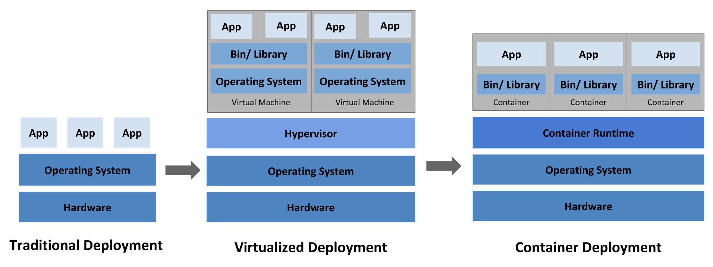
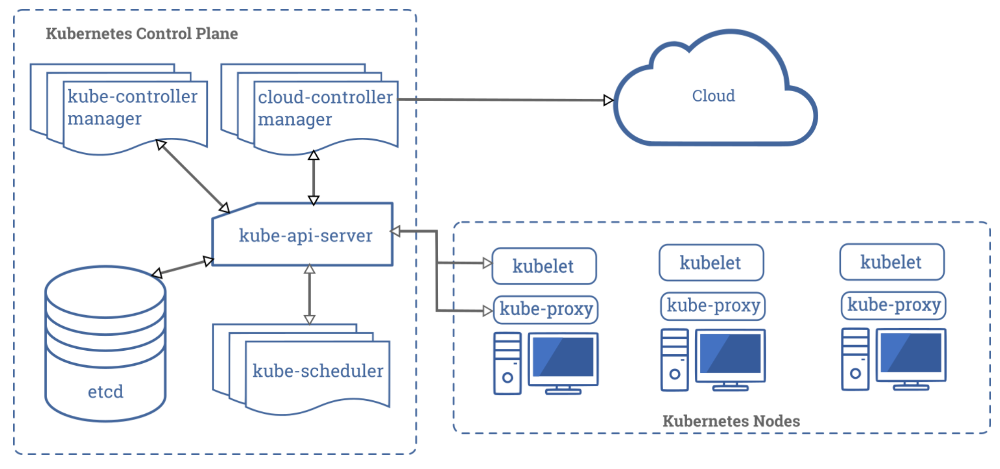

# k8s

## 演进

## 架构

- kube-apiserver
  - 主节点上负责提供 Kubernetes API 服务的组件；它是 Kubernetes 控制面的前端。
- etcd
  - 兼具一致性和高可用性的键值数据库，可以作为保存 Kubernetes 所有集群数据的后台数据库。
- kube-scheduler
  - 主节点上的组件，该组件监视那些新创建的未指定运行节点的 Pod，并选择节点让 Pod 在上面运行。
  - 调度决策考虑的因素包括单个 Pod 和 Pod 集合的资源需求、硬件/软件/策略约束、亲和性和反亲和性规范、数据位置、工作负载间的干扰和最后时限。
- kube-controller-manager 在主节点上运行控制器的组件。
  - Node Controller  负责在节点出现故障时进行通知和响应
  - Replication Controller 负责为系统中的每个副本控制器对象维护正确数量的 Pod
  - Endpoints Controller 填充端点(Endpoints)对象(即加入 Service 与 Pod)
  - Service Account & Token Controllers 为新的命名空间创建默认帐户和 API 访问令牌.
- kubelet
  - 一个在集群中每个节点上运行的代理。它保证容器都运行在 Pod 中。
- kube-proxy
  - 集群中每个节点上运行的网络代理,实现 Kubernetes Service 概念的一部分。
  - 维护节点上的网络规则。这些网络规则允许从集群内部或外部的网络会话与 Pod 进行网络通信。
  - 如果操作系统提供了数据包过滤层并可用的话，kube-proxy会通过它来实现网络规则。否则，kube-proxy 仅转发流量本身。

## 证书

## 资源介绍

- 控制器
  - Deployment 部署又称无状态集 常用
    - [脚本说明含注解](./deployment.yaml)
    - [官方文档](https://kubernetes.io/docs/concepts/workloads/controllers/deployment/)
  - StatefulSet 有状态集
    - [脚本说明含注解](./statefulset.yaml)
    - [官方文档](https://kubernetes.io/docs/concepts/workloads/controllers/statefulset/)
  - DaemonSet 守护程序集
    - [脚本说明含注解](./daemonset.yaml)
    - [官方文档](https://kubernetes.io/docs/concepts/workloads/controllers/daemonset/)
  - Job 任务
    - [脚本说明含注解](./job.yaml)
    - [官方文档](https://kubernetes.io/docs/concepts/workloads/controllers/jobs-run-to-completion/)
  - CronJob 定时任务 依赖Job
    - [脚本说明含注解](./cronjob.yaml)
    - [官方文档](https://kubernetes.io/docs/concepts/workloads/controllers/cron-jobs/)
  - StatefulSet 有状态集 很少用
    - [脚本说明含注解](./deployment.yaml)
    - [官方文档](https://kubernetes.io/docs/concepts/workloads/controllers/deployment/)
  - ReplicaSet 副本集
    - [脚本说明含注解](./deployment.yaml)
    - [官方文档](https://kubernetes.io/docs/concepts/workloads/controllers/deployment/)
  - ReplicationController 副本控制器
    - [脚本说明含注解](./deployment.yaml)
    - [官方文档](https://kubernetes.io/docs/concepts/workloads/controllers/deployment/)
