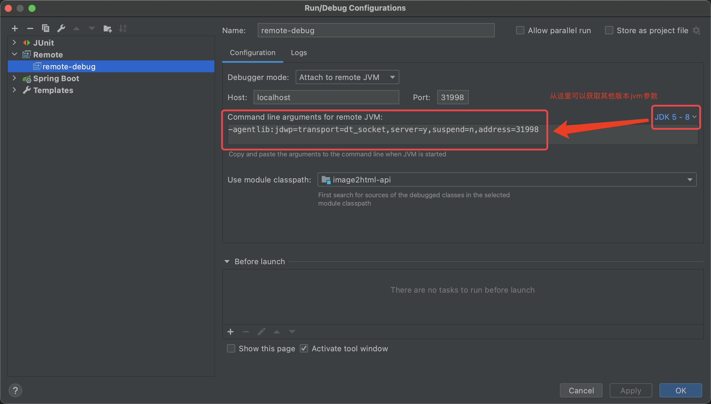
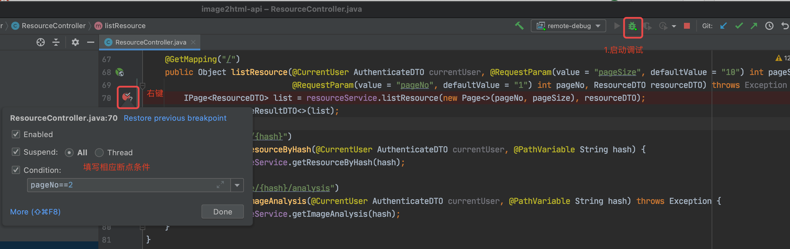

# jvm 基于 java8u252

网上搜索jvm调优有些博客比较陈旧，在容器化方面的介绍较少，在参考了n多博客的内容后做个总结。

如未特殊说明 k8s容器配置参数如下

| k8s-resource      | cpu | mem   |
| ----------------- | --- | ----- |
| request(最小资源) | 50m | 128Mi |
| limit(最大限制)   | 2   | 2Gi   |

## 常用命令

```sh
# 查看当前jvm最终使用的参数 包含行号信息 java8u252 有730个参数
java -XX:+PrintFlagsFinal -version|awk '{print NR $0}'

# 查看当前jvm跟heap和ram相关参数
java -XX:+PrintFlagsFinal -version | grep -Ei "heapsize|ram"

java -XX:+PrintCommandLineFlags -version

java -XshowSettings:vm -version

jmap -heap -pid
```

容器化后，常见添加的一个参数`-XX:+UseContainerSupport`启用容器支持，但这个参数在后期的版本已经默认支持了，无需指定。

```sh
# 查看容器化参数状态
java -XX:+PrintFlagsFinal -version | grep -Ei "Container"
bool PreferContainerQuotaForCPUCount           = true                                {product}
bool UseContainerSupport                       = true                                {product}
```

## 堆内存

通过`java -X`命令可以查看基础参数

- -Xmn 为年轻代（新生代）设置初始和最大堆大小（以字节为单位）
- -Xms 设置初始 Java 堆大小
- -Xmx 设置最大 Java 堆大小
- -Xss 设置 Java 线程堆栈大小
  - `java -XX:+PrintFlagsFinal -version | grep -Ei "stacksize"`可查看相关默认参数。

- -XX:InitialRAMPercentage 同Xms
- -XX:MinRAMPercentage
  - 这个参数明面上看会让人很困惑，因为他们上面的表面意思差不多，但实际大不一样
  - 仅当物理服务器（或容器）中的总可用内存大小`小于`250MB（大约）时，此参数才生效，意思是最大堆大小为这么多，不是指初始堆大小，同时`MaxRAMPercentage`参数失效。
- -XX:MaxRAMPercentage 同 Xmx
  - 仅当物理服务器（或容器）中的总可用内存大小`大于`250MB（大约）时，此参数才成效，意思是最大堆大小为这么多，同时`MinRAMPercentage`参数失效。

更详细的介绍见[参考资料](#参考资料)

因为我们的业务容器一般不会限制最大可用内存小于250M的情况，因此下面主要针对`InitialRAMPercentage`和`MaxRAMPercentage`参数讲解。

```sh
java -XX:+PrintFlagsFinal -version | grep -Ei "RAMPercentage"
double InitialRAMPercentage                      = 1.562500                            {product}
double MaxRAMPercentage                          = 25.000000                           {product}
double MinRAMPercentage                          = 50.000000                           {product}
java -XX:+PrintFlagsFinal -version | grep -Ei "heapsize"
uintx InitialHeapSize                          := 33554432                            {product}
uintx MaxHeapSize                              := 536870912                           {product}
```

| k8s-resource      | cpu | mem   | InitialHeapSize            | MaxHeapSize             |
| ----------------- | --- | ----- | -------------------------- | ----------------------- |
| request(最小资源) | 50m | 128Mi | -                          | -                       |
| limit(最大限制)   | 2   | 2Gi   | 2Gi*1.562500%=33554432 32m | 2Gi*25%=536870912 500+m |

### 计算公式

`InitialHeapSize`=`k8s-limit-mem`*`InitialRAMPercentage`

`MaxHeapSize`=`k8s-limit-mem`*`MaxRAMPercentage`

由上可以得出，在k8s容器化的环境中，我们一般会要求必须指定k8s limit参数，如果在调优时使用`-Xms -Xmx`参数，会比较麻烦，因为个人觉得调优要根据实际的情况来，并不是一次调好的，多次修改的话，同时修改k8s和jvm参数比较费事。

更合理的做法是使用百分比`InitialRAMPercentage`和`MaxRAMPercentage`，这样在调整limit参数时，对应的堆内存也能自动变化。

### 尝试调优

k8s limit mem为2Gi

#### 未调优

```log
-XX:InitialHeapSize=33554432 -XX:+ManagementServer -XX:MaxHeapSize=536870912 -XX:+PrintCommandLineFlags -XX:+UseCompressedClassPointers -XX:+UseCompressedOops -XX:+UseParallelGC
```

jvm最大堆内存为500+m，不是我们预想的2Gi-。

#### 调优

参数

```sh
-XX:MaxRAMPercentage=80.0 -XX:MinRAMPercentage=80.0
```

```log
-XX:InitialHeapSize=33554432 -XX:+ManagementServer -XX:MaxHeapSize=1717986918 -XX:MaxRAMPercentage=80.000000 -XX:MinRAMPercentage=80.000000 -XX:+PrintCommandLineFlags -XX:+PrintVMOptions -XX:+UseCompressedClassPointers -XX:+UseCompressedOops -XX:+UseParallelGC
```

jvm最大堆内存为1.7Gi+

`jps -mlvV`查看运行的java程序信息

```log
323 sun.tools.jps.Jps -mlvV -Dapplication.home=/usr/local/openjdk-8 -Xms8m
6 ./app.jar --server.port=80 -Djava.rmi.server.hostname=localhost -Dcom.sun.management.jmxremote.rmi.port=31999 -Dcom.sun.management.jmxremote.port=31999 -Dcom.sun.management.jmxremote.authenticate=false -Dcom.sun.management.jmxremote.ssl=false -Dspring.profiles.active=test -XX:+PrintVMOptions -XX:+PrintCommandLineFlags -XX:MaxRAMPercentage=80.0 -XX:MinRAMPercentage=80.0 -agentlib:jdwp=transport=dt_socket,server=y,suspend=n,address=31998
```

`jinfo -flags pid`查看指定java程序的jvm参数

```log
Attaching to process ID 6, please wait...
Debugger attached successfully.
Server compiler detected.
JVM version is 25.252-b09
Non-default VM flags: -XX:CICompilerCount=2 -XX:InitialHeapSize=33554432 -XX:+ManagementServer -XX:MaxHeapSize=1719664640 -XX:MaxNewSize=573046784 -XX:MaxRAMPercentage=null -XX:MinHeapDeltaBytes=524288 -XX:MinRAMPercentage=null -XX:NewSize=11010048 -XX:OldSize=22544384 -XX:+PrintCommandLineFlags -XX:+PrintVMOptions -XX:+UseCompressedClassPointers -XX:+UseCompressedOops -XX:+UseParallelGC
Command line:  -Djava.rmi.server.hostname=localhost -Dcom.sun.management.jmxremote.rmi.port=31999 -Dcom.sun.management.jmxremote.port=31999 -Dcom.sun.management.jmxremote.authenticate=false -Dcom.sun.management.jmxremote.ssl=false -Dspring.profiles.active=test -XX:+PrintVMOptions -XX:+PrintCommandLineFlags -XX:MaxRAMPercentage=80.0 -XX:MinRAMPercentage=80.0 -agentlib:jdwp=transport=dt_socket,server=y,suspend=n,address=31998
```

### 思考

会不会像安卓手机那样，给的内存大，占用的也大？待实验


## debug

建议优先使用`Arthas`抓取方法参数解决问题，如何使用`Arthas`参考阿里云栖号的这篇文章[如何使用 Arthas 提高日常开发效率？](https://mp.weixin.qq.com/s/FBZyiRXcz__GDA-vXNsxBg)。

### java自带远程调试

```sh
# jvm启动参数 不需要调试时不要添加（也可以通过idea获取其他版本参数配置，下图有说明）
-agentlib:jdwp=transport=dt_socket,server=y,suspend=n,address=31998
```

```yaml
# k8s容器配置方法
apiVersion: apps/v1
kind: Deployment
metadata:
  name: tr-test-image2html-api
spec:
  spec:
    containers:
      - env:
          - name: JAVA_OPTS
            value: -Dspring.profiles.active=test -XX:+PrintVMOptions -XX:+PrintCommandLineFlags -XX:MaxRAMPercentage=80.0 -XX:MinRAMPercentage=80.0 -agentlib:jdwp=transport=dt_socket,server=y,suspend=n,address=31998
        ports:
          - containerPort: 31998
            name: debug
            protocol: TCP

```

```sh
#使用 kubectl port-forward 命令将容器端口映射到本地
kubectl port-forward 你的容器名 31998
```

然后打开idea，选择对应项目，切换到对应版本的代码分支。

`Edit Configurations` -> `Templates` -> `remote` -> `Create configuration`，将`Port`改为`31998`。




这样就可以愉快的修BUG了，建议断点时先根据日志缩小一下范围和条件。

### 如何找到当前运行的代码分支

- 构建时将`commit sha`当做镜像标签
- 构建时将`commit sha`通过构建参数传入环境变量
  - 如果觉得构建参数麻烦可以直接用`sed`命令替换

```Dockerfile
# Dockerfile
# 将镜像标签写入镜像的环境变量,后端服务按需使用
ARG APP_IMAGE_TAG
ENV APP_IMAGE_TAG $APP_IMAGE_TAG
```

```sh
export |grep "APP_IMAGE_TAG"
declare -x APP_IMAGE_TAG="b4250250-202103291126"
```

即可获得当前运行的代码版本是`b4250250`。

## 参考资料

- oracle java8 relnotes
 - https://www.oracle.com/java/technologies/javase/8all-relnotes.html
- InitialRAMPercentage，MinRAMPercentage，MaxRAMPercentage
  - https://community.oracle.com/tech/developers/discussion/4478075/difference-between-initialrampercentage-minrampercentage-maxrampercentage
- 如何使用 Arthas 提高日常开发效率？
  - https://mp.weixin.qq.com/s/FBZyiRXcz__GDA-vXNsxBg
- 远程调试
  - https://docs.oracle.com/javase/8/docs/technotes/guides/jpda/
- Arthas 用户文档
  - http://arthas.gitee.io/