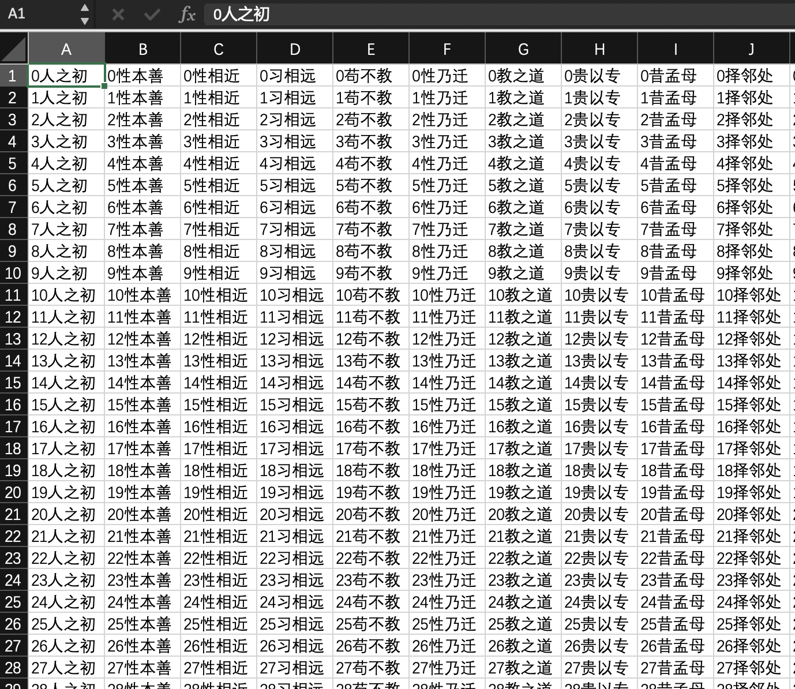
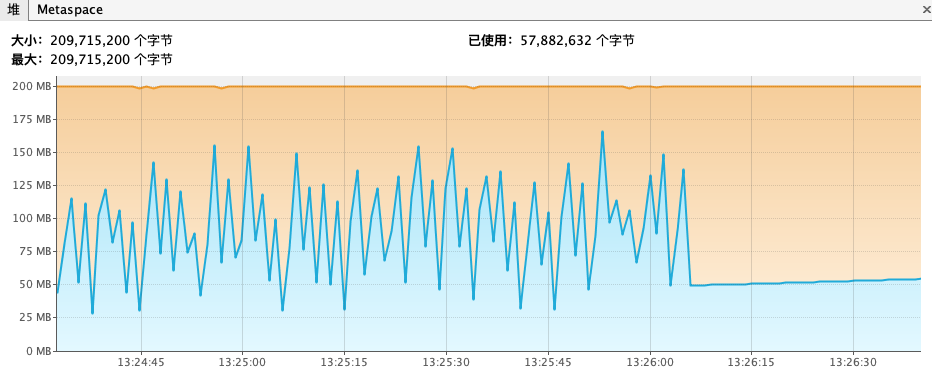
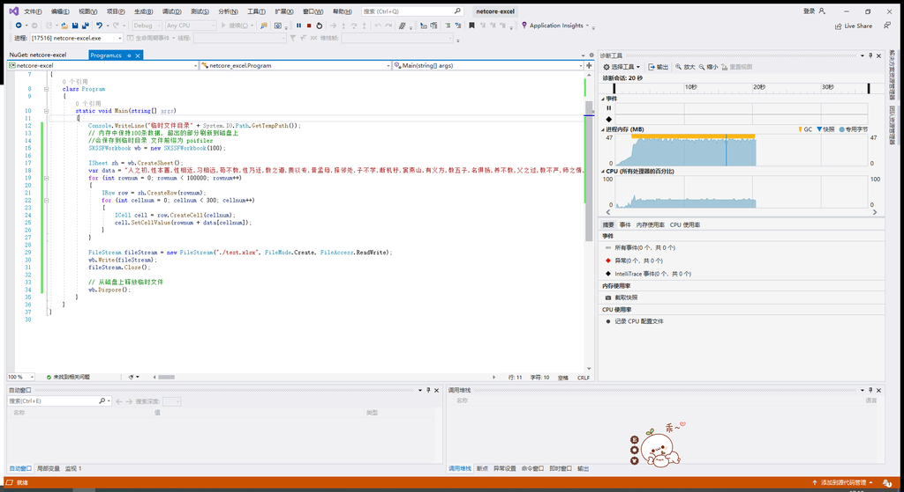

# 大量Excel数据写入测试

首先简单介绍一下xls和xlsx [摘自](https://github.com/alibaba/easyexcel/blob/master/abouteasyexcel.md)

xls是Microsoft Excel2007前excel的文件存储格式，实现原理是基于微软的ole db是微软com组件的一种实现，本质上也是一个微型数据库，由于微软的东西很多不开源，另外也已经被淘汰，了解它的细节意义不大，底层的编程都是基于微软的com组件去开发的。

xlsx是Microsoft Excel2007后excel的文件存储格式，实现是基于openXml和zip技术。这种存储简单，安全传输方便，同时处理数据也变的简单。

csv 我们可以理解为纯文本文件，可以被excel打开。他的格式非常简单，解析起来和解析文本文件一样。

针对大批量数据写入excel选择java和net两个用的比较多的开源库进行测试

| 语言 | 库                | star  |
| ---- | ----------------- | ----- |
| java | alibaba/easyexcel | 19.6k |
| net  | NPOI              | 3.6k  |


生成如下格式的 300列，10万行三字经，图例



## easyexcel

```java
// 例子源码见下方说明
private static void writeByEasyExcel() {
    String fileName = "./test.xlsx";
    String tmpDir=System.getProperty("java.io.tmpdir");
    System.out.println(tmpDir);
    // 临时目录地址 tmpDir+uid+poifile
    // 例如 /var/folders/k3/np6t_whj7z1cqw838hrmysfr0000gn/T/e252075d-bea4-4c6c-8912-2f4277e0a3a2/poifiles
    ExcelWriter excelWriter = null;
    try {
        // 这里 需要指定写用哪个class去写
        excelWriter = EasyExcel.write(fileName, Record.class).build();
        // 这里注意 如果同一个sheet只要创建一次
        WriteSheet writeSheet = EasyExcel.writerSheet("模板").build();
        // 模拟数据页数1000页
        for (int i = 0; i < 1000; i++) {
            // 分页去数据库查询数据 这里可以去数据库查询每一页的数据
            List<Record> data = new ArrayList<>();
            for (int j = 0; j < 100; j++) {
                data.add(new Record());
            }
            System.out.printf("写入批次数：%d\n", i);
            excelWriter.write(data, writeSheet);
        }
    } finally {
        // 千万别忘记finish 会帮忙关闭流
        if (excelWriter != null) {
            excelWriter.finish();
        }
    }
}
```

## NPOI

```C#
// 例子源码见下方说明
static void Nopi()
{
     Console.WriteLine("临时文件目录"+System.IO.Path.GetTempPath());
     //临时目录地址 tempPath + \poifiles\poi-sxssf-sheet + uuid +.xml
     //例如 /var/folders/k3/np6t_whj7z1cqw838hrmysfr0000gn/T/\poifiles\poi-sxssf-sheet74419a86-1e3c-435a-93aa-52bea8861760.xml
     //内存中保持100条数据, 超出的部分刷新到磁盘上 默认无参是：100
    SXSSFWorkbook wb = new SXSSFWorkbook(100);
    ISheet sh = wb.CreateSheet();
    var data = "****三字经****".Split(",");
    for(int rownum = 0; rownum < 100000; rownum++){
        IRow row = sh.CreateRow(rownum);
        for(int cellnum = 0; cellnum < 300; cellnum++){
            ICell cell = row.CreateCell(cellnum);
            cell.SetCellValue(rownum+data[cellnum]);
        }
    }
    FileStream fileStream = new FileStream("./test.xlsx",FileMode.Create,FileAccess.ReadWrite);
    wb.Write(fileStream);
    fileStream.Close();
    // 从磁盘上释放临时文件
    wb.Dispose();
}
```


## 实测结果

### easyexcel

VM限制：-Xmx200m，耗时2分钟多，生成excel文件大小132M。
使用jvisualvm观测运行时内存占用。因采用大对象集合的方式写入，所以GC波动较大。


### NOPI

耗时2分钟多，生成excel文件大小133M。无需创建大对象，因此GC不明显。实测了.net6 .netcore3.1 .net4.5三个版本，均支持。


easyexcel和NOPI运行时均采用了临时xml类型文件存储已生成表格数据，并不会将表格数据全部累加在内存中，这点通过内存观测工具和查看临时目录生成的文件得以验证。

## 资料

1. java和net例子地址 https://gitlab.colipu.com/tr/example/excel

更多示例参见官方文档

easyexcel开源地址 https://github.com/alibaba/easyexcel

NPOI开源地址 https://github.com/nissl-lab/npoi