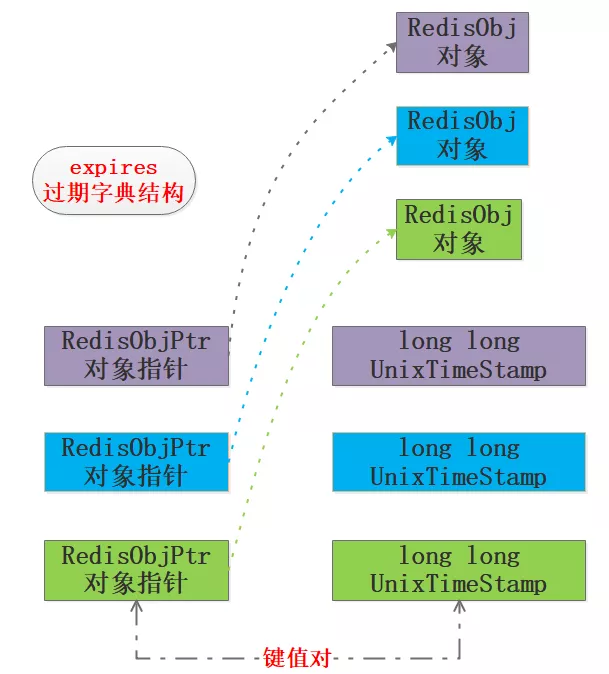
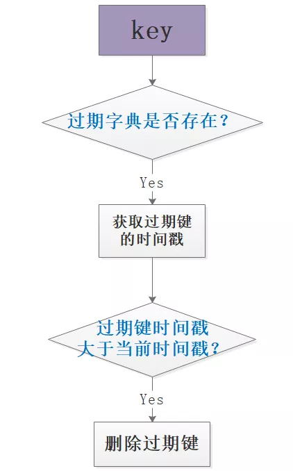

# redis相关问题

## 结构

- string 简单kv结构
- hash hash结构
- list 列表 可作为队列
- set 集合
- sortset 有序集合
- GEO 地理位置

底层数据结构


### SDS

Redis单独封装了SDS简单动态字符串结构


- 结构说明
  - alloc 分配的内存空间长度
  - len 有效字符串长度
  - flags 头部类型
- 相对于C语言用数组保存字符串优势
  - 头部直接记录了长度信息，方便取值，C语言要遍历到`\0`结尾符
  - 需要修改时可借助len和alloc即可确认是否需要扩展空间


### 关于线程

Redis并不是单纯的单线程服务模型，一些辅助工作比如持久化刷盘、惰性删除等任务是由BIO线程来完成的，这里说的单线程主要是说与客户端交互完成命令请求和回复的工作线程。

- 为什么是单线程
  - 指的是与客户端交互
  - CPU不是瓶颈，内存才是
  - 多线程操作资源对象时需加锁保证安全，会引发死锁问题，将key做hash分配给相同的线程来处理会增加key的hash处理以及多线程负载均衡的处理。可以采用集群方案扩展

## 时间事件

- 时间事件 间隔一段时间执行一次或定时触发一次
  - 删除数据库的key
  - 触发RDB和AOF持久化
  - 主从同步
  - 集群化保活
  - 关闭清理死客户端链接
  - 统计更新服务器的内存、key数量等信息


每次O(N)遍历获取需要执行的时间。

## Reactor模式

Redis基于Reactor模式(反应堆模式)开发了自己的网络模型，形成了一个完备的基于IO复用的事件驱动服务器。


IO复用：ae_epoll->ae_kqueue->ae_select

## 用途

- 缓存
- 队列
- 分布式锁 SET key value EX过期时间秒 PX过期毫秒 NX 不存在时执行 XX 存在时执行
  - 单Matster-Slave设置value为unique_value保证自己的锁只有自己能解开
- 排行榜

## AOF (Append Only File) 与 RDB (Redis DataBase)区别

- AOF 默认关闭 类似mysql binlog
  - 可通过 BGREWRITEAOF 手动触发重写
  - appendonly no 改成 yes 开启
  - appendfsync 附加文件同步方式
    - always 每次操作都落盘，低效
    - everysec 每秒操作一次罗盘，默认
    - no 操作系统自动操作把缓存数据写到硬盘上，不可靠，块
  - auto-aof-rewrite-percentage 100 当文件增长100%（一倍）时候，自动重写
  - auto-aof-rewrite-min-size 64mb 日志重写最小文件大小，如果小于该大小，不会自动重写
  - 优点
    - 每次都是指令追加备份，可以频繁同步
    - 备份文件过大时会自动重写
    - 如果没有限制FLUSHALL不可执行，可以恢复到执行命令前
  - 缺点
    - 属于操作日志记录，备份文件比RDB大
    - 大量写入，效率低需要执行更多的保存指令
    - 恢复耗时长


- RDB 时间快照 默认模式
  - 可配置定时执行
  - 可通过 SAVE/BGSAVE 手动执行
    - SAVE 阻塞执行，此时服务不会接受请求
    - BGSAVE Fork一个子进程出来，由该进程去执行保存RDB文件的操作，不影响用户请求
  - 优点
    - 恢复耗时短
    - Fork子进程进行持久化，使Redis可以更好地处理用户请求
  - 缺点
    - 保存不及时会因为意外丢失数据
    - 大量数据的情况下fork的子进程会占用大量CPU资源


```conf
#参数详见 /etc/redis.conf
# RDB保存配置方式
save 900 1
save 300 10
save 60 10000
```

## 垃圾回收

- 数据状态分类
  - 带过期的、不带过期的
  - 热点数据、冷数据




内存淘汰机制 6种

- noeviction: 当内存不足以容纳新写入数据时，新写入操作会报错；
- allkeys-lru：当内存不足以容纳新写入数据时，在键空间中移除最近最少使用的 key；
- allkeys-random：当内存不足以容纳新写入数据时，在键空间中随机移除某个 key；
- volatile-lru：当内存不足以容纳新写入数据时，在设置了过期时间的键空间中，移除最近最少使用的 key；
- volatile-random：当内存不足以容纳新写入数据时，在设置了过期时间的键空间中，随机移除某个 key；
- volatile-ttl：当内存不足以容纳新写入数据时，在设置了过期时间的键空间中，有更早过期时间的 key 优先移除；

后三种是基于过期时间字典操作的，可能存在都为设置过期时间，随机删除也不合理，可能把热key给删除掉
一般选中 `allkeys-lru` 算法。


## 集群同步

- 从从复制
- 全量复制
- 增量复制
- 无盘复制

## 常见问题

- 缓存击穿
  - 指热点key在某个时间点过期的时候，而恰好在这个时间点对这个Key有大量的并发请求过来，从而大量的请求打到db
  - 解决方案
    - 程序不主动更新，获取不到通过队列异步批量检查更新
    - 定时更新方案（缺点可能存在缓存浪费的问题）
- 缓存穿透
  - 查询一个一定不存在的数据，由于缓存是不命中时需要从数据库查询，查不到数据则不写入缓存，这将导致这个不存在的数据每次请求都要到数据库去查询，进而给数据库带来压力
  - 解决方案
    - 不存在也写null到缓存中，设置较短过期时间
- 缓存雪崩
  - 缓存中数据大批量到过期时间，而查询数据量巨大，引起数据库压力过大甚至down机
  - 解决方案
    - 设置随机过期时间

## 相关资料

[看完这篇再也不怕redis面试了](https://mp.weixin.qq.com/s/8AFFCrtv0MLRBEDaCAjnaA)