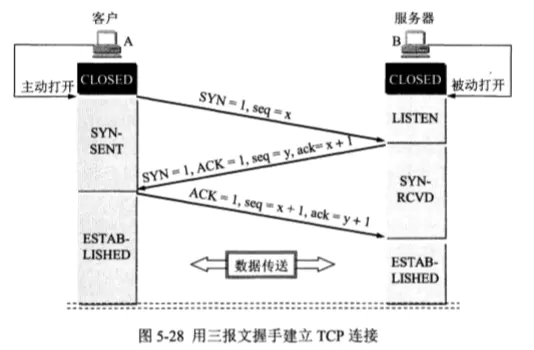
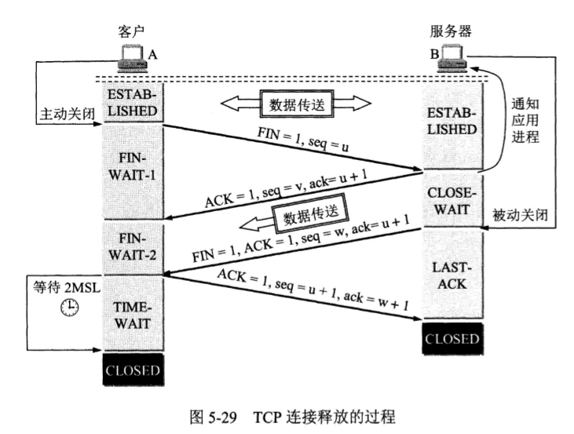

# 网络问题

- ACK Acknowledge character 确认字符
- SYN Synchronousidle character 同步字符
- NAK Negative Acknowledge character 否认字符


- Seq Sequence Number 序列号
- Ack Acknowledgement Number 确认应答号
- Checksum TCP数据段的校验和

- CLOSED 初始关闭状态
- LISTEN 服务端初一监听状态，可以连接了
- SYN_SENT 客户端发起创建连接请求后的状态
- SYN_RECV 接收到客户端连接请求并回应后的服务端状态
- ESTABLISHED 已建立连接状态
- FIN_WAIT_1 向对方发送FIN报文后等待响应的状态
- FIN_WAIT_2 对方响应ACK报文后，自身进入此状态
- TIME_WAIT 表示收到了对方的FIN报文，并发送出了ACK报文，就等2MSL（max segment lifetime）(RFC793定义120s，linux为30s)后即可回到CLOSED可用状态了。如果FIN_WAIT_1状态下，收到了对方同时带FIN标志和ACK标志的报文时，可以直接进入到TIME_WAIT状态，而无须经过FIN_WAIT_2状态。
- CLOSING 双方同时发送FIN报文后，尚未收到对方ACK，但是收到了对方FIN后的状态。说明此次两端都想要关闭了。
- CLOSE_WAIT 接收到对方的FIN报文后，响应了ACK报文，但是此时有尚未发送发的数据，进入此状态。
- LAST_ACK 被动关闭一方在发送FIN报文后，最后等待对方的ACK报文。当收到ACK报文后，也即可以进入到CLOSED可用状态了。

## 三次握手



- 客户端发起 SYN  Seq=i 并进入 SYN_SENT 状态
- 服务端响应 ACK和SYN Ack=i+1 Seq=j 并进入 SYN_RECV 状态
- 客户端响应 ACK Seq=i+1 Ack=j+1 进入 ESTABLISHED 状态

## 握手完毕

确认缓冲区大小

Windows size value 该端缓冲区大小

- 服务端 TCP Window Update Seq=Ack ACK=Seq

## 四次挥手



- 客户端发起 FIN和ACK Seq=i
- 服务端发起 ACK Ack=i+1 Seq=j 客户端
- 服务端发起 FIN和ACK Ack=i+1 Seq=j
- 客户端发起 ACK Ack=j+1 Seq=j

## 常见问题

```shell
# 查看各阶段状态
netstat -n | awk '/^tcp/ {++S[$NF]} END {for(a in S) print a, S[a]}'
```

### 客户端大量TIME_OUT


高并发时大量短连接未关闭导致的

- go中 http.Transport设置KeepAlive 默认的是30秒

```golang
http.Client{
    Timeout: 5 * time.Second,
    Transport: &http.Transport{
        Proxy: http.ProxyFromEnvironment,
        DialContext: (&net.Dialer{
            Timeout:   1 * time.Second,
            KeepAlive: 30 * time.Second,
            DualStack: true,
        }).DialContext,
        MaxIdleConns:        100,
        MaxIdleConnsPerHost: 8,
        IdleConnTimeout:     120 * time.Second,
    },
}
```

```conf
# timestamps打开的前提下才能生效使用
net.ipv4.tcp_timestamps = 1
net.ipv4.tcp_tw_reuse = 1
net.ipv4.tcp_tw_recycle = 0 （不要开启，现在互联网NAT结构很多，可能直接无法三次握手）
机器作为客户端时起作用，开启后time_wait在一秒内回收
net.ipv4.tcp_tw_recycle = 0
```

## DNS

/etc/resolv.conf 中配置多个nameserver需要配置options

- rotate 轮询
- timeout 1 超时
- attempts 3 重试